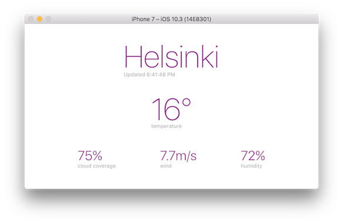

# weathery
This is a simple weather app. It's done with:
- MVVM architecture
- Stack views
- UI tests
- Reactive (to come)
- [FBSnapshotTestCase](https://github.com/facebook/ios-snapshot-test-case)

 

